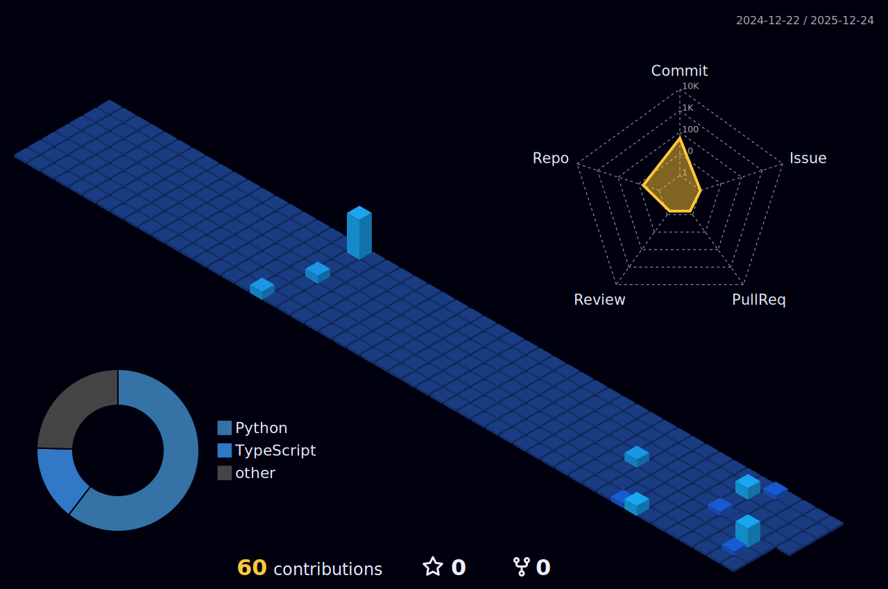

<!-- =========================
     Nithin Reddy Poola | GitHub Profile README
     ========================= -->

<!-- Hero -->
<p align="center">
  
</p>

<p align="center">
  <a href="https://nithinreddy.com"></a>
  <a href="https://nithinreddy.com/about"></a>
  <a href="https://www.linkedin.com/in/nithinreddypoola"></a>
  <a href="mailto:nithinreddypoola@gmail.com"></a>
</p>

<p align="center">
  
</p>

---

## ✦ About
I’m **Nithin Reddy Poola** — a systems-focused full-stack engineer who loves building *real* platforms: the kind that provision infrastructure, serve thousands of users, and stay reliable when things go wrong.

- 🧠 **Systems mindset:** distributed systems, queues, caching, SLIs/SLOs, and end-to-end observability  
- 🔐 **Security-minded:** SAML/SSO, OAuth2/OIDC, RBAC, secure sessions, and audit logs  
- ⚙️ **Operator-friendly:** CI/CD gates, health checks, structured logs/metrics, production hardening  
- 🤖 **AI builder:** real-time AI products, ML pipelines, and CUDA-adjacent work  

---

## ⚡ Proof of Work (numbers that matter)
- ⏱️ Reduced provisioning/deploy time by **~90%** (≈30 min → **<5 min**) and handled **1,000+** concurrent requests.  
- ✅ Reliability upgrades (idempotent queues + retries/backoff + health checks + logs/metrics) driving **99.9% uptime**.  
- 🔐 Shipped **SAML 2.0 SSO + RBAC**, cutting account/support tickets by **95%+**.  
- 🎙️ Built a low-latency AI interview platform streaming audio with **<150ms** delay and **92%** topic accuracy.  
- 🚀 CUDA/PyTorch work: custom CUDA kernel optimization for LSTM training, **45% faster** on a **4× NVIDIA A100** cluster.

---

## 🧰 Tech Stack
<p align="center">
  
</p>

<p align="center">
  <sub>Also: queues/background jobs • observability • virtualization (vCenter) • secure SDLC • performance tuning</sub>
</p>

---

## 🧩 Featured Builds
<p align="center">
  <a href="https://nithinreddy.com/work">
    
  </a>
</p>

### 🛡️ UMBC CyberRange Platform
Self-service portal that provisions isolated lab environments with **VMware vCenter automation**, **SAML SSO**, **RBAC**, and production guardrails (Docker/NGINX/TLS + logging/metrics).

### 🧠 AgentX — AI Life Copilot / Automation Platform
Multi-agent orchestration + guardrails + observability with a modern UI (workflow builder, approvals, replay, diffing).

### 📈 FluCast — Outbreak Forecasting
Forecasting service that fuses CDC feeds with LSTM ensembles and dashboards (ETL → modeling → serving → visualization).

### 🎙️ Real-Time AI Interview Platform
Streaming audio → live feedback, scoring, transcripts, and analytics; accessibility-first UI (ARIA).

---

## 🌀 3D + Animations (the “wow” section)
### 🌌 3D Contribution Graph
> After you enable the workflow below, this will render as a **3D-looking** SVG:
<p align="center">
  
</p>

### 🐍 Contribution Snake
<p align="center">
  
</p>

---

## 📊 GitHub Signals
<p align="center">
  
  
</p>

<p align="center">
  
</p>

---

## 🤝 Let’s Connect
<p align="center">
  <a href="https://nithinreddy.com/contact"></a>
  <a href="https://www.linkedin.com/in/nithinreddypoola"></a>
  <a href="mailto:nithinreddypoola@gmail.com"></a>
</p>

---

<!-- =========================
     Optional: enable the workflows below for 3D + snake animations.
     Add these files in your repo under .github/workflows/
     ========================= -->

<details>
<summary><b>✅ (Optional) Workflow: 3D Contribution Graph</b></summary>

Create: <code>.github/workflows/3d-contrib.yml</code>

```yml
name: Generate 3D Contribution Graph

on:
  schedule:
    - cron: "0 18 * * *"
  workflow_dispatch:

jobs:
  build:
    runs-on: ubuntu-latest
    steps:
      - uses: actions/checkout@v4

      - name: Generate 3D Contrib
        uses: yoshi389111/github-profile-3d-contrib@0.7.1
        env:
          GITHUB_TOKEN: ${{ secrets.GITHUB_TOKEN }}
          USERNAME: poolanithinreddy

      - name: Commit & Push
        run: |
          git config user.name "github-actions"
          git config user.email "github-actions@github.com"
          git add -A
          git commit -m "chore: update 3d contrib" || exit 0
          git push
