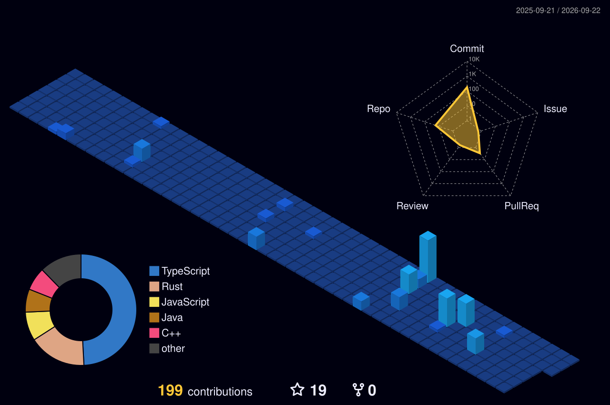

<!-- Nithin Reddy Poola | GitHub Profile README -->

<!-- ============ HERO ============ -->
<p align="center">
  
</p>

<p align="center">
  <a href="https://nithinreddy.com/portifolio/"></a>
  <a href="https://www.linkedin.com/in/nithinreddypoola"></a>
  <a href="mailto:nithinpoolareddy@gmail.com"></a>
  <a href="https://nithinreddy.com/Resume.pdf"></a>
  <a href="https://nithinreddy.com/work"></a>
</p>

<p align="center">
  <a href="https://nithinreddy.com/">
    
  </a>
</p>

<br/>

<!-- ============ ABOUT ============ -->
## ⟢ About

I'm **Nithin Reddy Poola** — an **MS Computer Science** candidate at **UMBC** and a systems-focused **full-stack & AI engineer**. I build the kind of software that has to *stay up*: platforms that provision real infrastructure, AI products that respond in real time, and developer tools that make engineers faster.

I care about the parts most people skip — failure modes, auth boundaries, observability, idempotency, and the 50ms that separate "fine" from "fast." I treat UX and reliability as the same problem viewed from two ends.

```yaml
focus:      [ AI coding agents, platform engineering, infra automation ]
strengths:  [ distributed systems, secure auth (SAML/OIDC/RBAC), real-time AI ]
philosophy: "design for failure · automate the boring · instrument everything"
based_in:   "Baltimore, MD · UMBC"
now:        "shipping ApeironCode — an autonomous, review-ready coding agent"
```

<br/>

<!-- ============ PROOF OF WORK ============ -->
## ⟢ Proof of Work

> Real systems, measurable outcomes. Numbers reflect my own projects; values marked _(est.)_ are self-measured estimates.

| Impact | What it took |
|---|---|
| **~90% faster provisioning** — lab/VM spin-up cut from ~30 min to **under 5 min** _(est.)_ | VMware vCenter API automation + templated, self-service workflows |
| **1,000+ concurrent requests** handled with **~99.9% uptime** _(est.)_ | Idempotent job queues, retries/backoff, health checks, structured logs & metrics |
| **95%+ fewer access tickets** _(est.)_ | **SAML 2.0 SSO + RBAC**, scoped sessions, and audit logging |
| **<150ms** audio round-trip on a real-time AI interview platform | Streaming pipeline, backpressure handling, low-latency transport |
| **~45% faster** LSTM training across a **4× NVIDIA A100** cluster | Custom CUDA kernel optimization + PyTorch profiling |

<br/>

<!-- ============ FEATURED BUILDS ============ -->
## ⟢ Featured Builds

<table>
<tr>
<td width="50%" valign="top">

### ◆ ApeironCode
**AI coding agent & developer tool**

An open-source, local-first coding agent that plans, edits, and verifies changes across real codebases while keeping every action inspectable.

`TypeScript` `Node.js` `VS Code` `JetBrains` `LLM orchestration`

> **Impact:** turns multi-file engineering tasks into reviewable, automated workflows.

[Source](https://github.com/poolanithinreddy/ApeironCode) · [Documentation](https://github.com/poolanithinreddy/ApeironCode#readme)

</td>
<td width="50%" valign="top">

### ◆ UMBC CyberRange Platform
**Full-stack cyber lab platform**

Self-service portal that provisions isolated lab environments on demand, with production guardrails end to end.

`vCenter` `SAML SSO` `RBAC` `Docker` `NGINX` `Metrics`

> **Impact:** ~90% faster lab provisioning _(est.)_ with secure, auditable access.

[Case study](https://nithinreddy.com/work)

</td>
</tr>
<tr>
<td width="50%" valign="top">

### ◆ AgentX
**AI life copilot / multi-agent automation**

Multi-agent orchestration with guardrails, approvals, replay, and a workflow builder — observability baked into every run.

`Multi-agent` `Orchestration` `React` `Node.js` `Observability`

> **Impact:** safe, inspectable automation for everyday tasks.

[Source](https://github.com/poolanithinreddy/AgentX) · [Live](https://agent-x-mauve.vercel.app)

</td>
<td width="50%" valign="top">

### ◆ FluCast
**Outbreak forecasting research**

Forecasting service fusing public health feeds with LSTM ensembles, served through clean analytical dashboards.

`Python` `PyTorch` `ETL` `LSTM` `Dashboards`

> **Impact:** end-to-end pipeline — ingestion → modeling → serving → viz.

[Source](https://github.com/poolanithinreddy/Flu_cast)

</td>
</tr>
<tr>
<td width="50%" valign="top">

### ◆ Real-Time AI Interview Platform
**Low-latency conversational AI**

Streaming audio with live feedback, scoring, transcripts, and analytics — accessibility-first (ARIA) UI.

`Streaming` `Real-time AI` `WebRTC` `Next.js`

> **Impact:** <150ms audio round-trip with live, structured feedback.

[Live](https://nithinreddy.com/)

</td>
<td width="50%" valign="top">

### ◆ ML · Federated Learning · Sensor Systems
**Applied research & infra**

Federated learning experiments and sensor-data pipelines, with CUDA-level performance tuning on GPU clusters.

`PyTorch` `CUDA` `Federated Learning` `Edge`

> **Impact:** ~45% faster training via custom CUDA kernels _(est.)_.

[Neurosymbolic Transformers](https://github.com/poolanithinreddy/Neurosymbolic-Transformers)

</td>
</tr>
</table>

<p align="center">
  <a href="https://nithinreddy.com/work"></a>
</p>

<br/>

<!-- ============ TECH STACK ============ -->
## ⟢ Tech Stack

<table>
<tr>
  <td valign="top"><strong>Frontend</strong></td>
  <td></td>
</tr>
<tr>
  <td valign="top"><strong>Backend</strong></td>
  <td></td>
</tr>
<tr>
  <td valign="top"><strong>AI / ML</strong></td>
  <td> &nbsp;<sub>· LLM orchestration · multi-agent · CUDA</sub></td>
</tr>
<tr>
  <td valign="top"><strong>Cloud / DevOps</strong></td>
  <td></td>
</tr>
<tr>
  <td valign="top"><strong>Databases</strong></td>
  <td></td>
</tr>
<tr>
  <td valign="top"><strong>Systems / Infra</strong></td>
  <td> &nbsp;<sub>· VMware vCenter · observability · CI/CD</sub></td>
</tr>
<tr>
  <td valign="top"><strong>Security / Auth</strong></td>
  <td><sub>SAML 2.0 · OAuth2 / OIDC · RBAC · secure sessions · audit logging · secure SDLC</sub></td>
</tr>
</table>

<br/>

<!-- ============ CURRENTLY BUILDING ============ -->
## ⟢ Currently Building

- **ApeironCode** — pushing an AI coding agent toward reliable, multi-file, review-ready autonomy.
- **Full-stack AI systems** — real-time, observable, and production-hardened by default.
- **Infra automation** — turning manual ops into self-service platforms with guardrails.

<br/>

<!-- ============ GITHUB SIGNALS ============ -->
## ⟢ GitHub Signals

<p align="center">
  
  
</p>

<p align="center">
  
</p>

<!-- 3D contribution graph — auto-generated daily by .github/workflows/3d-contrib.yml -->
<p align="center">
  
</p>

<!-- Contribution snake — auto-generated daily by .github/workflows/snake.yml (output branch) -->
<p align="center">
  
</p>

<br/>

<!-- ============ CTA ============ -->
## ⟢ Let's Build Something

I'm always open to working on **AI tools, infrastructure platforms, full-stack products, and open source**. If you're building something hard, I want to hear about it.

<p align="center">
  <a href="https://nithinreddy.com/"></a>
  <a href="https://www.linkedin.com/in/nithinreddypoola"></a>
  <a href="https://nithinreddy.com/Resume.pdf"></a>
  <a href="mailto:nithinpoolareddy@gmail.com"></a>
</p>

<p align="center"><sub>Designed for a 30-second skim and a 3-minute deep read. · © Nithin Reddy Poola</sub></p>
